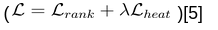
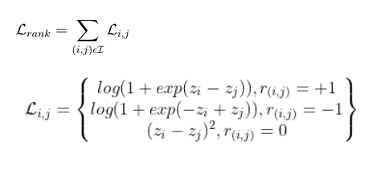
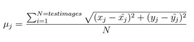

# PoseReconstruction

### Abstract

The ability to train an end-to-end neural network for 3D pose estimation from a single image suffers from lack of 3D annotation for natural images. The variability of 2D pose datasets is difficult to achieve for 3D pose data sets which are captured using MoCap systems. In our project we try to show the effectiveness of using ordinal depth annotations on 2D datasets to train ConvNets for 3D pose reconstruction. The depth annotations are easy to acquire and produce relative depth estimates which provide a weak form of supervision for full 3D pose reconstruction. This approach thus effectively incorporates the variability of 2D dataset for training an end-to-end system for 3D pose reconstruction from a single RGB image.

### Introduction

Reconstruction of 3D human pose is valuable for many applications such as human motion analysis in sports, rehabilitation and character control in AR/VR systems. A natural approach to solving this problem is to use sensors that can directly measure distances in 3D space. This includes the Kinect, body-mounted IMUs, multi-view camera systems, etc. While these provide valuable depth information, there has historically been a lack of reliable ground truth labels. For this reason, the majority of approaches have depended solely on monocular RGB images.

While there is a greater supply of datasets for labeled, monocular RGB images, the reconstruction problem has three significant challenges: (i) it is a severely ill-posed problem because similar image projections can be derived from different 3D poses; (ii) it is an ill-conditioned problem since minor errors in the locations of the 2D body joints can have large consequences in the 3D space; and (iii) it suffers from high dimensionality.

An end-to-end system for 3D human pose estimation is therefore desirable. However, the bottleneck is the scarcity of reliable 3D ground truth data for in the wild scenes. Most datasets use the MoCap system that is difficult to install and can collect 3D ground truth data only in indoor settings. Therefore these datasets lack variability of datasets such as the MPII dataset or the LSP dataset. 

To address this problem, Ordinal Depth Supervision for 3D Human Pose Estimation[5] introduced the concept of ordinal depth and demonstrated its effectiveness in state-of-the-art pose estimation systems. With ordinal depth, each joint’s position in the z-axis is relative to each other rather than a specific position in 3d space. This allows for the use of more easily generated annotations and, ultimately, more expansive and varied datasets.

For this project, we tried to recreate some approaches from the paper linked above to recover 2D joint positions and depth predictions from ordinal relations. Our depth predictions are on a relative scale. We could not implement full 3D reconstruction as given in the paper due to unanticipated issues with access to the Human 3.6M dataset that we were relying on for 3D ground truth data.

The focus of our project therefore has been to try different variants / network architectures to predict accurate ordinal depth.

### Related Work

We looked at other approaches that leveraged human models such as SMPL or transfer learning to solve this problem. 

https://arxiv.org/abs/1611.09813 [2]: Monocular 3D Human Pose Estimation In The Wild Using Improved CNN Supervision. This paper uses transfer learning techniques to use 2D pose datasets to learn 3D poses. The approach that we have implemented is much simpler with only the use of ordinal depths to provide a weak form of supervision for the full 3D pose reconstruction problem.

https://dl.acm.org/doi/abs/10.1145/3072959.3073596 [3]: This paper presents skeleton fitting on localized 2D joint positions to recover a 3D pose. 

https://openaccess.thecvf.com/content_cvpr_2018/papers/Pavlakos_Learning_to_Estimate_CVPR_2018_paper.pdf [4]: This paper comes from the same group as the one that motivated our current direction, talks about learning parameters of the SMPL model from 2D images and therefore gets around the problem of the lack of 3D ground truth data. However, this paper implements the full shape reconstruction which is beyond our current scope. 

### Methods

#### Dataset 

We primarily used the MPII and LSP dataset with 2D joint position annotations and ordinal depth relations for images in the wild. 

The LSP(Leeds Sports Pose) dataset contains 2000 pose annotated images of mostly sports people gathered from Flickr. The images have been scaled such that the most prominent person is roughly 150 pixels in length. Each image has been annotated with 14 joint locations. These are available in the joints.mat as a 3*14*2000 matrix. We also acquired the ordinal relation annotations through contacting the authors of the paper. These are available in the ordinal.mat as a 2000*14*14 matrix.

MPII Human Pose dataset is a state of the art benchmark for evaluation of articulated human pose estimation. The dataset includes around 25K images containing over 40K people with annotated body joints. The images were systematically collected using an established taxonomy of everyday human activities. Overall the dataset covers 410 human activities. However, for this project, we used only a subset of this dataset with 13K images. Similar to the LSP dataset, the 2D annotation for joint positions is contained in the joint.mat as a  3*16*13030 matrix. The ordinal depth relation are present in ordinal.mat as 13030* 16* 16 matrix. 

#### Preprocessing

Our preprocessing pipeline consists of first cropping the human in the image using a bounding box calculated using the mean of joint positions and scale() which was calculated using the extremas of the annotated joints. We resize the cropped image to 256*256 pixels, maintaining the aspect ratio.

For data augmentation, we flip the image and apply rotation of  degrees. This augmentation is done randomly in the __getitem__ function of the BuildDataset class. 

#### Network Architecture

The network takes in a 2D image and passes it through an hourglass network [1]. As the name implies the hourglass network is similar to an auto-encoder network that shrinks the input and then decodes it. The intermediate outputs from the convolution network resemble the shape of an hourglass. For our application, the nature of our decoded output are heatmaps for joint prediction. We stack hourglasses to improve the learning capability of the network. Feeding heatmaps from one hourglass as input to the next hourglass allows the network to learn the relationship between the joints positions that later hourglass networks can learn from the outputs of the previous hourglasses. The network is forced to pay attention to other joints while predicting the location of a new joint. The hourglass network also allows us to introduce intermediate losses, which promotes better propagation of losses. The hourglass network also makes use of skip connections similar to the ResNet architecture to improve learning as the networks tend to be very deep.

For our scenario, we were only able to use one hourglass as opposed to a stacked hourglass network. This is mainly due to limitation of training time and computational resources. We expect that with the stacking of more hourglasses, the performance of the network will naturally improve.

Human poses have high variance. Therefore it is intractable to regress joint positions directly from a deep neural network. We briefly looked at regressing on the position of the max of the heatmaps instead of doing the gaussian loss, but were always producing one heatmap per joint. To work around this problem, it was proposed that the network output  heatmaps, one for each joint. The ground truth for these heat maps would be a gaussian centered around the true location of the 2D joints. This increases the representation and learning capabilities of the network. The learning is improved as the network now learns a distribution of joint locations instead of a direct regressed mapping to a continuous space. This is a much more tractable problem and therefore produces better learning outcomes.

As mentioned previously, we are also interested in predicting ordinal depth for each of these joints. To do so, we tested three extensions of the hourglass network. First, we tried appending fully-connected layers to the end of the network and learning the heatmaps and ordinal relations simultaneously. Unfortunately, this approach had difficulty converging as the depth layers could not get useful signal from the untrained heatmaps and would backpropagate gradients to the core hourglass layers that interfered with learning. With this in mind, we adjusted our approach to first fully train the hourglass network and then use its outputs to train an ordinal depth prediction network. With this configuration, we tested two different architectures. The first used the heatmaps and applied max pooling to reduce the dimension from {joints, 64, 64} to {joints, 16, 16} before passing it through 3 fully-connected layers. For the second, we developed a network to learn ordinal depth relations from the penultimate layer of the hourglass network. This layer has the same spatial dimension as the output, but has 256 channels which we believe contain greater general context about the image (much like the feature pyramid networks used in previous projects). This layer is first passed to a 1x1 convolutional layer that reduces the channel dimension to 64 before being passed through two fully-connected layers. 
 
#### Losses

For these networks, we use rank loss for ordinal depth prediction and heatmap loss for planar joint coordinate prediction. When used simultaneously, as seen in our first implementation, these components are scaled to a similar magnitude 

The rank loss definition shown here is used to maximize the difference in depth estimate between joints that are not on the same plane (target relation +/- 1) and minimize the difference in depth estimate of joints marked roughly in-plane (target relation 0). 

Where  is the ordinal relationship between joint i and j.  and  are the relative depth estimates produced by our network.

Where w_n and w_n_hat are the ground truth and the predicted heat maps respectively. Our Loss objective is to minimize the L_2 loss for heatmaps.
 
#### Training

Optimizer: Adam 

Learning Rate: 2.5e-4

Epochs: 145

No of Hourglass Networks: 1

 
### Experiments and Analysis 

#### Experiment 1

We first tried to train a joint neural network with both  and . The ordinal depth predictions were regressed from the heatmaps using fully connected layers appended to the end of the network. We however observed that the network was not learning much and our losses were not converging. 

#### Experiment 2

We then tried to decouple the two learning objectives by training the network only for . We observed that the network was now able to recover 2D joint positions on images in the test set. We verified the performance of the network, both through a visual inspection of the outputs as well as calculating an Average Joint Distance on the test set. 

The average joint distance for joint j is given by:

We obtained Average Joint Distance for the 14 annotated joints:  [7.7076, 6.2410, 5.4199, 5.3687, 6.4607, 7.8869, 2.9242, 4.4677, 8.3792, 6.5866, 4.2519, 4.1936, 6.2540, 8.5441]. The loss plot is shown below.

#### Experiment 3

Encouraged by this performance of this network, we reasoned that the ordinal depth rank loss was interfering with the keypoint loss. We tried to build a network that would directly regress both the 2D locations and the relative depth values. However we quickly learned that this approach would not work primarily because it would be intractable to learning a direct mapping from images to coordinates in a continuous space. We discovered that heat maps improve the learning of the network primarily because the network now learns distribution of the joint locations instead of a direct continuous mapping. We were even unable to overfit a model when training under this mode.

#### Experiment 4

Our main problem was therefore the decoupling of losses, since we observed in Experiment 2 that the network converged while only training with the heatmap loss. We therefore used the network from experiment 2 and trained a separate network for ordinal depth which would take the heat maps as input and pass it through 5 fully connected layers. However we observed that the Rank Loss gradients were not backpropagating properly to the initial layers. We reasoned that this was a result of having too many layers. We subsequently tried to reduce the number of layers in the network to 3 fully connected layers. This resulted in decent loss curves.
 
To better compare the performance of different ordinal depth prediction networks, we also introduced an Ordinal Depth Accuracy metric. Similar to the loss function, we first use the relative depth predictions to get a matrix of ordinal relations. To compare this to the target relations (having values {-1, 0, 1}), we classify relations r <= -0.5 as label -1, -0.5 <= r <= 0.5 as label 0 and r >= 0.5 as label 1. For these 3 and 5 layer fully-connected networks, we found accuracies of  29.04% and 50.13%, respectively.

#### Experiment 5

Our last experiment was to use the penultimate layer to connect our network for learning ordinal depths. In discussions with the TAs, we concluded that the heatmaps(our output layers) ideally would not have sufficient context for the ordinal depth network to reason about relative depth information. We thus branched off this network from the penultimate layer of the hourglass network to provide a richer context for the ordinal depth network. Because the output of this layer is much deeper than the heatmap output (256 channels vs 14 channels), we introduced a new depth prediction network that leads with a 1x1 convolution. This allows us to reduce the channel depth by a factor of 4 and dramatically reduce the number of parameters in the subsequent fully-connected layers. We found convergence of this network to be highly sensitive to changes in learning rate, but we were ultimately able to obtain decent loss curves by introducing a learning rate scheduler.

With this network, we achieved our highest Ordinal Depth Accuracy of 58.35%. Looking at the loss curve, we believe that this could be improved upon with additional training time.

### Conclusion

In conclusion, we learned about the different available datasets for Pose Reconstruction. We also learned about the representation power of hourglass networks and the use of heat maps to make learning tractable for learning objectives which suffer from high variability. While we could not train the full network due to the lack of time and computational resources, we were able to design a network that recovers both 2D joint positions and produces relative depth measurements for human joints. In future work, these results can be used to train a subsequent network to recreate the full 3D pose.

### References

[1] Newell, Alejandro, Kaiyu Yang, and Jia Deng. "Stacked hourglass networks for human pose estimation." European conference on computer vision. Springer, Cham, 2016.

[2] Mehta, Dushyant, et al. "Monocular 3d human pose estimation in the wild using improved cnn supervision." 2017 international conference on 3D vision (3DV). IEEE, 2017

[3] Mehta, Dushyant, et al. "Vnect: Real-time 3d human pose estimation with a single rgb camera." ACM Transactions on Graphics (TOG) 36.4 (2017): 1-14.

[4] Pavlakos, Georgios, et al. "Learning to estimate 3D human pose and shape from a single color image." Proceedings of the IEEE Conference on Computer Vision and Pattern Recognition. 2018.

[5] Pavlakos, Georgios, Xiaowei Zhou, and Kostas Daniilidis. "Ordinal depth supervision for 3d human pose estimation." Proceedings of the IEEE Conference on Computer Vision and Pattern Recognition. 2018.

